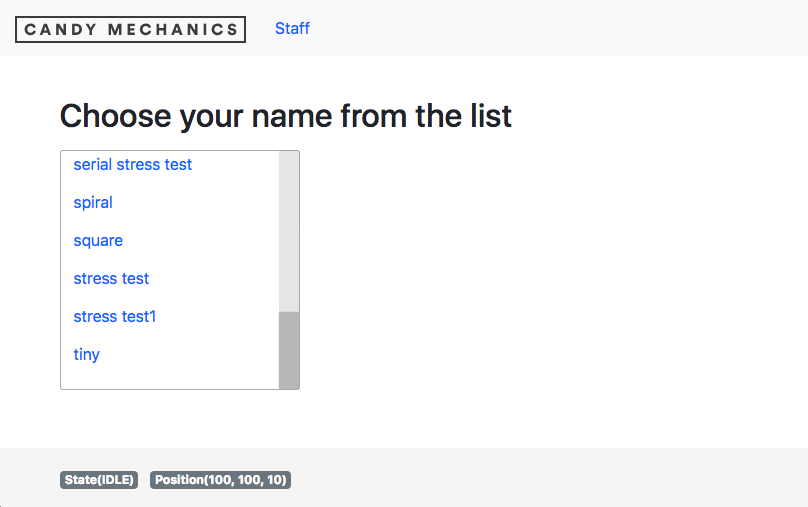
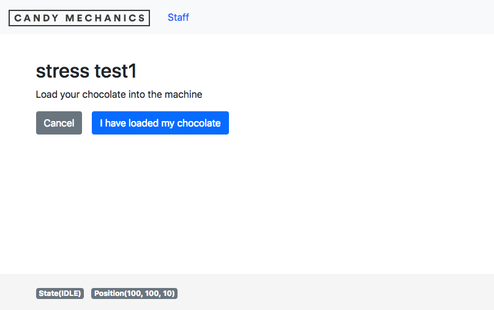
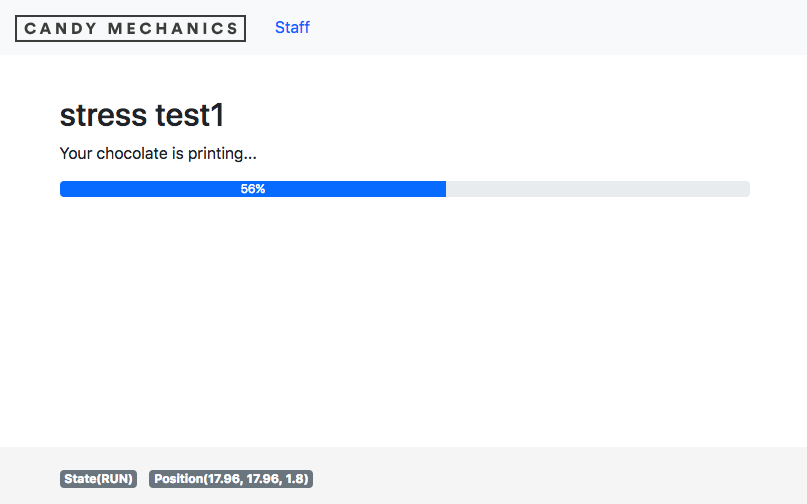
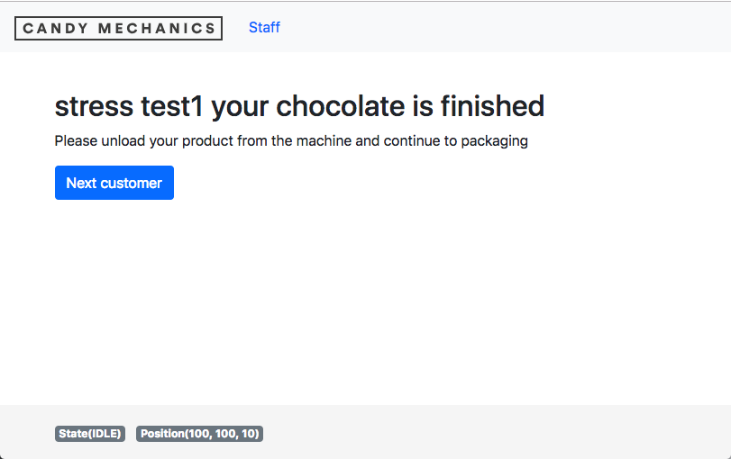

# UgsCandyMechanics

## Selecting the file to print
> 

This page will let the user choose a file to print. The files are fetched from the workspace directory set by the UGS server.

## Confirm that chocolate has been loaded
> 

## Confirm to start printing/carving
> 

## Progress of printing/carving
> 

No movement of the machine is done in any of the pages except for in this page. It will execute the workflow manager `src/app/workflow-manager.ts` which will start handling the printing/carving workflow. Once the workflow has finished the next page will load.

### Homing
Executes the homing command on the server and will wait for it to complete. If homing isn't activated the command will be ignored. Any locks will be cleared at this stage.

### Move to origin
Executes the script defined in the property `moveToOriginCommand` in `src/environemnts/environment.ts`. This script can consist of multiple commands separated with a new line character `\n`.

### Send file
Starts sending the loaded file

### Eject
Executes the script defined in the property `ejectCommand` in `src/environemnts/environment.ts`. This script can consist of multiple commands separated with a new line character `\n`.

## Finished and ask for next customer

